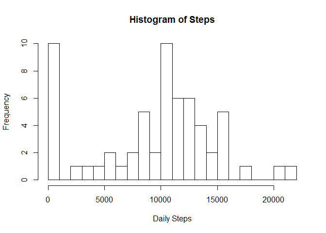
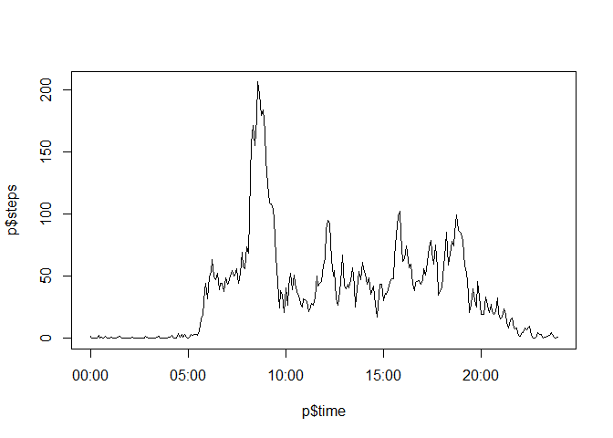

Calling required libraries
--------------------------

    library(dplyr)

    ## Warning: package 'dplyr' was built under R version 3.3.2

    ## 
    ## Attaching package: 'dplyr'

    ## The following objects are masked from 'package:stats':
    ## 
    ##     filter, lag

    ## The following objects are masked from 'package:base':
    ## 
    ##     intersect, setdiff, setequal, union

    library(ggplot2)
    library(lubridate)

    ## Warning: package 'lubridate' was built under R version 3.3.2

    ## 
    ## Attaching package: 'lubridate'

    ## The following object is masked from 'package:base':
    ## 
    ##     date

    library(lattice)

Reading data to R
-----------------

    data <- read.csv("./activity.csv")
    df <- tbl_df(data)
    df$date <- as.Date(df$date)

Calculating the summary and making a histogram
----------------------------------------------

    mean <- mean(df$steps, na.rm = TRUE)
    median <- median(df$steps, na.rm = TRUE)
    s <- df %>% group_by(date) %>% summarize(daily_steps = sum(steps, na.rm = TRUE))
    hist(s$daily_steps, breaks = 20, main = "Histogram of Steps", xlab = "Daily Steps")

 The total
number of steps taken each day - Mean is 37.3825996 - Median is 0

Daily walking pattern
---------------------

    p <- df %>% group_by(interval) %>% summarize(steps = mean(steps, na.rm = TRUE))
    p$minute <- p$interval %% 100 
    p$hour <- p$interval %/% 100
    p$time <- hm(paste(p$hour,p$minute, sep = ":"))
    p$time <- as_date(p$time)
    plot(p$time, p$steps, type = "l" )

    max <- p[which(p$steps == max(p$steps)),]$time
    hour <- hour(max)
    minute <- minute(max)
    time <- sprintf("%s:%s",hour, minute)

The interval of the day when the person is most active in walking is
8:35

Imputing missing values
-----------------------

    miss <- sum(is.na(df$steps))
    impute.median <- function(x) replace(x, is.na(x), median(x, na.rm = TRUE))
    df <- df  %>% mutate(steps = impute.median(steps))

Now when we calculated the missing values using the median values of
each interval it is time to see how it changed the median and mean
values of the steps taken each day.

    mean <- mean(df$steps, na.rm = TRUE)
    median <- median(df$steps, na.rm = TRUE)
    s <- df %>% group_by(date) %>% 
            summarize(daily_steps = sum(steps, na.rm = TRUE))
    hist(s$daily_steps, breaks = 20, main = "Histogram of Steps", xlab = "Daily Steps")

The total number of steps taken each day when missing values are filled
- Mean is 32.4799636 - Median is 0

Looking at weekend effect
-------------------------

`{r weekend}------------------------------------000000 df <- df %>%          mutate(weekday = ifelse(weekdays(date)                  %in% c("Saturday", "Sunday"), "Weekend", "Weekday")) p <- df %>% group_by(interval, weekday) %>%          summarize(steps = mean(steps, na.rm = TRUE)) xyplot(steps ~ interval | weekday, p, type = 'l', layout = c(1,2))`
